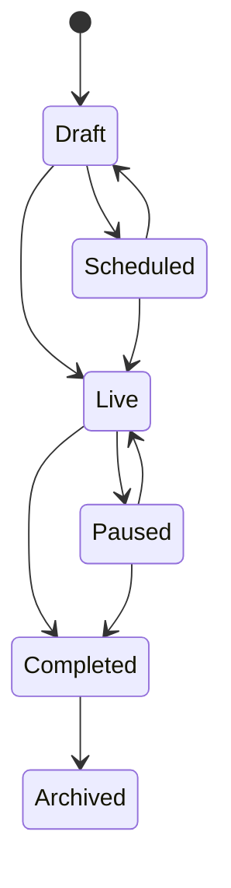
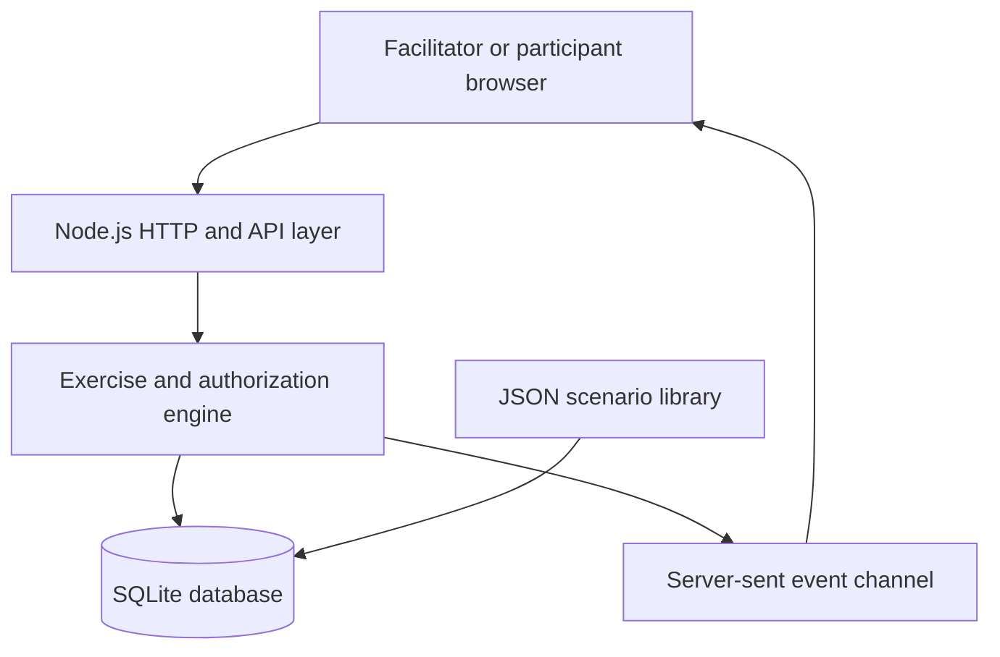

# Project TAB — Test a Breach

Project TAB is a self-hosted platform for planning, facilitating and reviewing cyber tabletop exercises. It gives facilitators a live command room, gives participants a focused response room, and preserves the decisions, actions, scores and evidence needed for a useful after-action review.

The application is deliberately dependency-light: Node.js provides the web server, cryptography, test framework and SQLite driver. No package installation, Docker service, cloud account or external database is required. By default, it listens only on the local computer and stores everything in a local SQLite file.

## What is included

- Facilitator dashboard and exercise portfolio
- Scenario-template library loaded from human-readable JSON
- Exercise creation, scheduling and state management
- Participant access codes and exercise-scoped sessions
- Manual or timed inject release
- Live updates using server-sent events
- Participant decisions, observations, requests and situation updates
- Confidence ratings for participant responses
- Cross-exercise action register with owners, priorities, dates and status
- Facilitator timeline and decision log
- Six-category scoring framework
- Evidence and reference register
- Markdown after-action reports and complete JSON export
- Administrator, facilitator, observer and participant roles
- Account management, forced temporary-password replacement and audit logging
- Responsive interface for desktop, tablet and mobile
- One-click Windows launcher and a macOS/Linux launcher
- Optional Docker and Docker Compose deployment
- Automated lifecycle integration tests

## Included scenario templates

1. **Identity-to-SaaS Data Extortion** — vishing, MFA approval, SaaS persistence, data theft and extortion.
2. **Automotive Manufacturing Shutdown** — precautionary shutdown, supplier impact, public claims and phased restart.
3. **Cloud Control-Plane Wiper** — privileged identity compromise, endpoint-management abuse, BYOD impact and global recovery.
4. **GxP Privileged Account Compromise** — regulated manufacturing constraints, audit-trail integrity, Quality decisions and validated recovery.

The templates represent realistic incident classes and are designed for exercise use. They are not forensic accounts of Jaguar Land Rover, Stryker, ShinyHunters or any other specific incident. Public claims and attribution should always be kept separate from confirmed facts when adapting a real case.

## Quick start

### Requirements

- Node.js 24 or later
- A modern browser

### Windows: one-click local launch

Extract the ZIP and double-click:

```text
Start-Project-TAB.cmd
```

The launcher verifies Node.js, starts the local server, opens the browser and stores data in `data\project-tab.db`. Keep the command window open while using Project TAB; press `Ctrl+C` to stop it.

### macOS or Linux

```bash
chmod +x start-project-tab.sh
./start-project-tab.sh
```

### Command-line alternative

```bash
cd project-tab
npm start
```

Open `http://127.0.0.1:8080`.

Development bootstrap credentials:

```text
Username: admin
Password: TAB-Admin-2026!
```

Project TAB requires the bootstrap password to be changed after sign-in. See [LOCAL-RUN.md](LOCAL-RUN.md) for local-network participant access, port selection, backups and moving the installation.

### Optional: run with Docker Compose

Docker is not needed for local operation. It remains available as an optional deployment method.

Create a `.env` file beside `docker-compose.yml`:

```env
TAB_ADMIN_USERNAME=admin
TAB_ADMIN_PASSWORD=replace-with-a-long-unique-password
TAB_ADMIN_NAME=TAB Administrator
TAB_SECURE_COOKIES=false
```

Then run:

```bash
docker compose up -d --build
```

The container is exposed on `http://localhost:8080`, and its database is retained in the `project-tab-data` Docker volume.

When deploying behind HTTPS, change `TAB_SECURE_COOKIES` to `true`.

## Running an exercise

### 1. Prepare

1. Sign in as an administrator or facilitator.
2. Open **Scenario library** and preview a scenario.
3. Select **Use scenario**.
4. Name the exercise, identify the organization, select severity and choose manual or timed inject release.
5. Review injects, expected actions and facilitator notes in the exercise control room.

### 2. Invite participants

The exercise room displays an eight-character participant code. Participants select **Participant** on the login screen, enter the code and provide their name, team and exercise role.

Each participant receives an exercise-scoped session. Participant API responses cannot see pending injects, expected response themes, facilitator notes, scores, evidence records or other participants' submitted responses.

### 3. Facilitate

1. Start the exercise.
2. Release injects manually, or enable timed release to publish them according to their `offsetMinutes` value.
3. Observe participant responses in real time.
4. Record key decisions, communications and observations in the timeline.
5. Create actions as gaps or follow-up needs emerge.
6. Score response evidence by inject and category.

### 4. Review

Complete the exercise when active play ends. In **Review & report**:

- review average assessment scores;
- add evidence and reference links;
- confirm action owners and due dates;
- download the Markdown after-action report; and
- export the complete exercise record as JSON.

## Roles

| Role | Capabilities |
|---|---|
| Administrator | Full exercise access, user management and audit history |
| Facilitator | Create, operate, score and report exercises |
| Observer | Read facilitator views without changing exercise state |
| Participant | Join one exercise, view released injects, respond and create actions |

## Exercise lifecycle



## Architecture



### Project structure

```text
project-tab/
├── public/                 Browser application and styles
├── scenarios/              Version-controlled scenario definitions
├── src/
│   ├── app.js              HTTP API, authorization and exercise engine
│   ├── auth.js             Password and session handling
│   ├── config.js           Environment configuration
│   ├── database.js         Schema, migrations and scenario seeding
│   ├── report.js           After-action report generation
│   └── utils.js            Validation and HTTP helpers
├── tests/api.test.js       Full lifecycle integration test
├── data/                   Runtime SQLite database
├── Start-Project-TAB.cmd   One-click Windows launcher
├── Start-Project-TAB.ps1   Windows local/LAN launcher
├── start-project-tab.sh    macOS/Linux launcher
├── LOCAL-RUN.md            Local operation and backup guide
├── Dockerfile
├── docker-compose.yml
├── SECURITY.md
└── server.js
```

## Configuration

| Variable | Default | Purpose |
|---|---|---|
| `HOST` | `127.0.0.1` | Listening interface; use `0.0.0.0` only for trusted LAN access |
| `PORT` | `8080` | Listening port |
| `TAB_DB_PATH` | `./data/project-tab.db` | SQLite database location |
| `TAB_ADMIN_USERNAME` | `admin` | First-start administrator username |
| `TAB_ADMIN_PASSWORD` | Development value | First-start administrator password |
| `TAB_ADMIN_NAME` | `TAB Administrator` | Administrator display name |
| `TAB_SESSION_HOURS` | `12` | Facilitator session lifetime |
| `TAB_SECURE_COOKIES` | `false` | Require HTTPS for session cookies |
| `TAB_TRUST_PROXY` | `false` | Trust the first `X-Forwarded-For` address |

Bootstrap administrator variables apply only when the user table is empty. Changing them later does not reset an existing account.

## Scenario format

Scenario definitions are JSON files in `scenarios/`. They are validated during parsing and copied into the database at startup. Existing exercises retain their copied injects when a template is updated.

```json
{
  "id": "tpl_unique_name_v1",
  "version": 1,
  "name": "Scenario name",
  "summary": "What the exercise tests.",
  "category": "Data breach",
  "sector": "Cross-sector",
  "difficulty": "Intermediate",
  "durationMinutes": 120,
  "threatActor": "Unknown external actor",
  "tags": ["identity", "data-theft"],
  "objectives": ["Validate containment decisions."],
  "environment": {
    "identity": "Cloud identity provider",
    "assumptions": ["Audit logs are available"]
  },
  "injects": [
    {
      "sequence": 1,
      "offsetMinutes": 0,
      "title": "Initial alert",
      "channel": "SOC alert",
      "body": "What participants are told.",
      "expectedActions": ["Declare the incident"],
      "facilitatorNotes": "What the facilitator should observe."
    }
  ]
}
```

See [docs/SCENARIO-SCHEMA.md](docs/SCENARIO-SCHEMA.md) for authoring guidance and [docs/scenario.schema.json](docs/scenario.schema.json) for the machine-readable JSON Schema.

## Tests

```bash
npm run check
npm test
```

The integration test uses an isolated temporary SQLite database and verifies:

- health and authentication controls;
- scenario loading and exercise creation;
- lifecycle transition to live operation;
- participant join and authorization boundaries;
- inject release and participant response;
- actions, scoring, timeline and evidence capture;
- completion, Markdown report and JSON export; and
- user administration and audit records.

## Data and backup

All durable application data is stored in the configured SQLite database. Scenario source JSON remains in the `scenarios` directory.

For a simple development backup, stop Project TAB and copy the `data` directory. For an online production backup, use SQLite's backup facility or snapshot the complete persistent volume consistently.

## Production guidance

Read [SECURITY.md](SECURITY.md) before exposing the platform beyond a trusted development environment. At minimum:

- replace the bootstrap password;
- use HTTPS and secure cookies;
- restrict network access;
- encrypt and back up the database;
- create named accounts; and
- review every scenario for factual accuracy and legal appropriateness.

## License

Project TAB is supplied under the MIT License.
